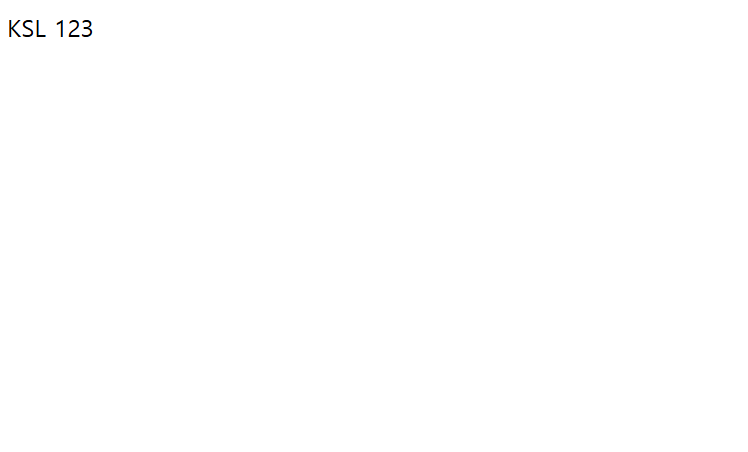
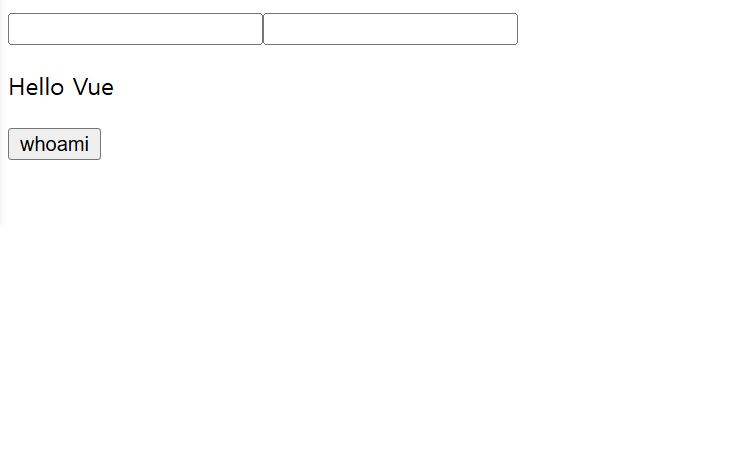
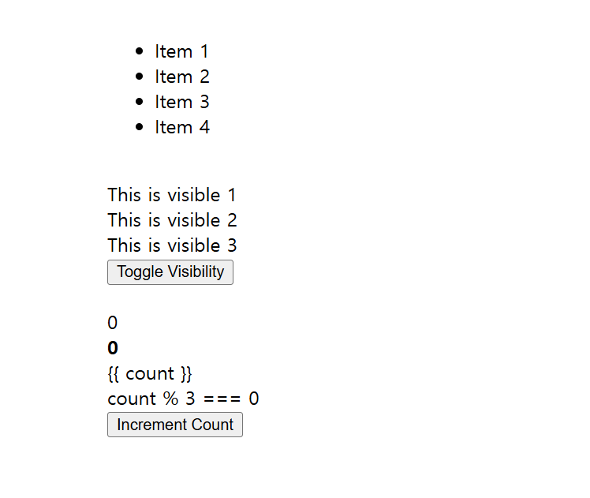
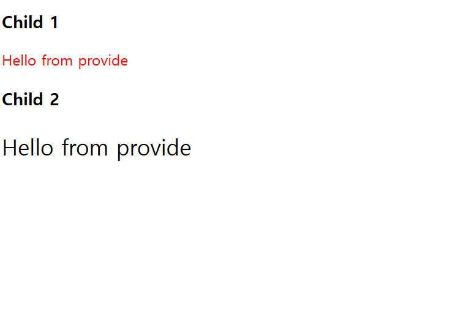
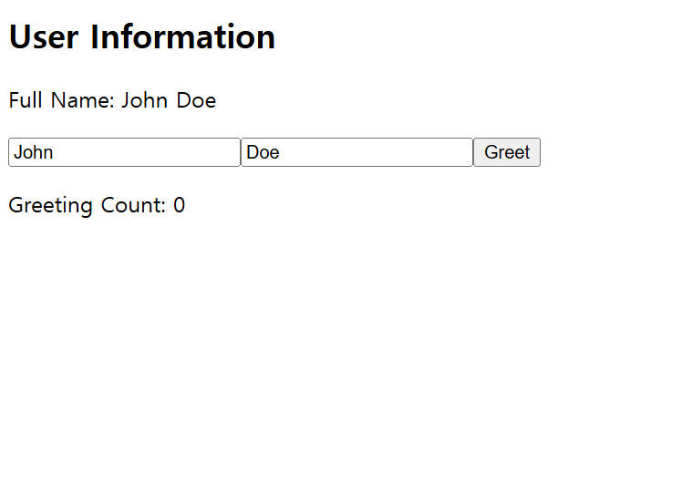
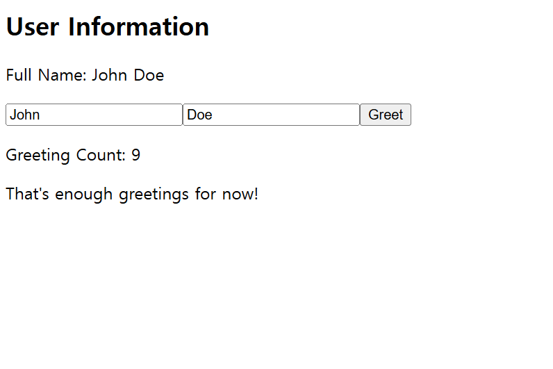
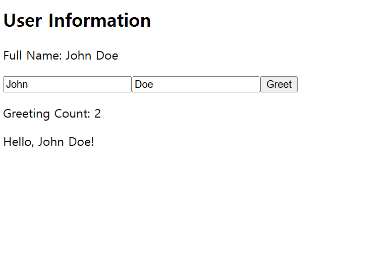
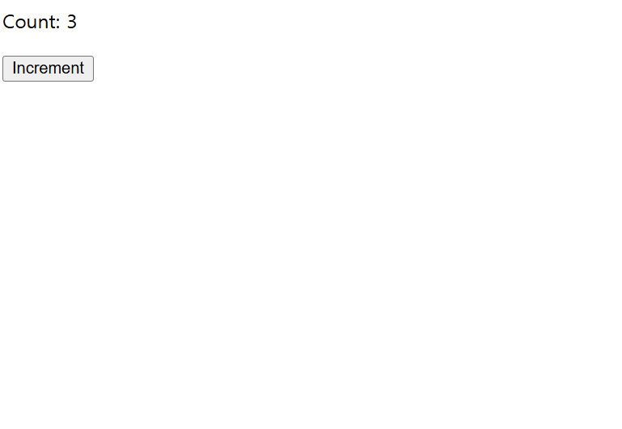
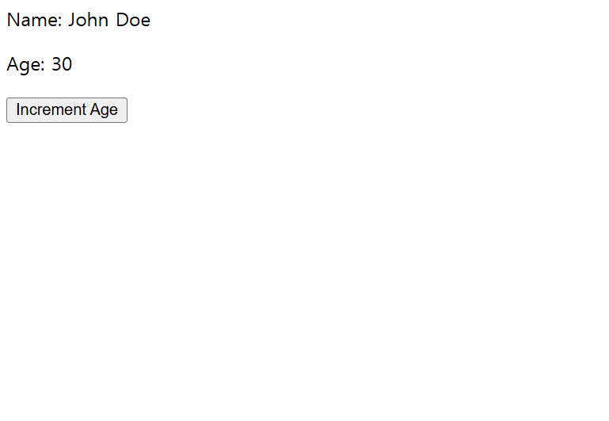

# Vue 2 → Vue 3 (Composition API + TypeScript) 변환 정리

## 1. 개요

이 프로젝트는 기존 Vue 2 기반 예제 코드들을 **Vue 3 + Composition API + TypeScript** 스타일로 리팩토링한 샘플 모음입니다.
모든 `.vue` 파일은 통일된 구조와 작성 규칙을 따르며, 학습 및 마이그레이션 참고용으로 사용할 수 있습니다.

---

## 2. 공통 포맷

모든 컴포넌트는 아래 구조를 유지합니다.

```vue
<template>
  <!-- 템플릿 -->
</template>

<script lang="ts">
export default {
  name: 'ComponentName'
}
</script>

<script setup lang="ts">
/**
 * Composition API 로직
 * - defineProps / withDefaults
 * - defineEmits
 * - ref / reactive / computed / watch
 * - onMounted 등 라이프사이클
 * - provide / inject
 */
</script>

<style scoped>
/* 스타일 */
</style>
```

---

## 3. 주요 변경 사항 요약

### 3.1 컴포넌트 정의 방식

* **변경 전 (Vue 2)**: `export default { ... }` 내에 data, methods, computed, lifecycle 등 옵션 집합.
* **변경 후 (Vue 3)**:

  * `<script lang="ts">`에는 **컴포넌트 name만 유지**
  * 실제 로직은 `<script setup lang="ts">`에서 Composition API로 구현

### 3.2 상태 관리 (data → ref / reactive)

* `data()`로 선언하던 상태를 `ref`, `reactive`로 분리.
* 예:

  * `message: 'Hello'` → `const message = ref('Hello')`
  * 객체 상태 필요 시 `reactive` 또는 `interface + reactive` 사용.

### 3.3 계산 속성 (computed)

* `computed: { ... }` → `computed(() => ...)`로 변경.
* `this` 제거 후, `ref/reactive` 값을 직접 참조.

### 3.4 메서드 (methods)

* `methods` 블록 제거.
* `<script setup>` 내 **일반 함수** 또는 **화살표 함수**로 정의.
* `this` 기반 접근 제거 → 지역 변수/함수 직접 참조.

### 3.5 감시자 (watch)

* `watch: { foo(newVal, oldVal) { ... } }` →

  ```ts
  watch(foo, (newVal, oldVal) => { ... }, { immediate, deep })
  ```

### 3.6 라이프사이클 훅

* Vue 2 훅 → Vue 3 Composition API 훅으로 매핑:

  * `created` → `<script setup>` 상단 로직
  * `mounted` → `onMounted`
  * `beforeDestroy` → `onBeforeUnmount`
  * `destroyed` → `onUnmounted`
  * 기타 훅도 동일 규칙 적용.

### 3.7 Props 정의

* 기존 `props: { ... }` 제거.
* `defineProps` + `withDefaults` + TypeScript 인터페이스 사용.

```ts
interface Props {
  title?: string
}

const props = withDefaults(defineProps<Props>(), {
  title: 'User Information'
})
```

### 3.8 이벤트 전달 ($emit)

* `this.$emit('event', payload)` →

  ```ts
  const emit = defineEmits<{
    (e: 'event', payload: string): void
  }>()
  emit('event', payload)
  ```

### 3.9 provide / inject

* Vue 2 옵션 API 기반에서 Composition API로 변경:

  * `provide` → `provide('key', value)`
  * `inject` → `const injected = inject<Type>('key', defaultValue)`

### 3.10 DOM 참조 ($refs)

* `ref="input"`, `this.$refs.input` →

  ```ts
  const input = ref<HTMLInputElement | null>(null)
  // template: <input ref="input" />
  // script: input.value
  ```

---

## 4. 예시 구성

각 예제는 Vue 3 스타일로 변환된 대표 케이스를 포함합니다.

* `example1`

  * 인스턴스 생성, 기본 `ref` 사용
* `example2`

  * 디렉티브, 조건부 렌더링, 반복 렌더링
* `example3`

  * 부모-자식 간 props 전달 및 커스텀 이벤트 (`defineProps`, `defineEmits`)
* `example4`

  * `provide / inject` 패턴
* `example5`

  * Options API → Composition API 마이그레이션 비교
* `example6`

  * `ref`, `reactive`, DOM ref 활용 예제

---

## 5. 동작 확인용 스크린샷

아래 스크린샷은 변환된 컴포넌트(`E-01-instance.vue`) 실행 화면 예시입니다.
| 컴포넌트 (.vue)| 스크린샷 |
| ---------------------------------- | ------------------------------------------------------------ |
| example1/E-01-instance.vue         |                |
| example1/E-02-reactive.vue         |                |
| example1/E-03-binding.vue          |                  |
| example2/E-04-directives.vue       |            |
| example3/ParentComponent.vue       |  |
| example4/ParentComponent.vue       |  |
| example5/E-07-Options-API.vue      |            |
| example5/E-08-composition-api.vue  |    |
| example5/E-09-composition-API2.vue |  |
| example6/E-10-ref.vue              |                          |
| example6/E-11-reactive.vue         |                |
| example6/E-12-ref-component.vue    |        |


---